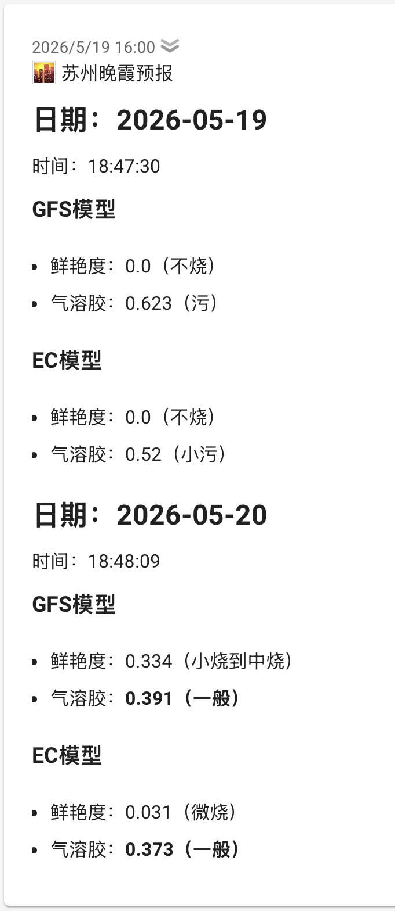

## 朝霞晚霞预警脚本程序

用户可通过环境变量配置每天查询火烧云的时间和预期质量，最后通过 ntfy 推送信息。

由 sunsetbot.top 提供接口。

## 部署

推荐使用 Docker Compose 部署：

```yaml
services:
  sunsetbot:
    container_name: sunsetbot
    image: ghcr.io/felix2yu/sunsetbot:latest
    environment:
      - CITY=江苏省-苏州
      - BASE_URL=https://sunsetbot.top/
      - PUSH_ENABLE=true
      - NTFY_SERVER=https://ntfy.sh
      - NTFY_TOPIC=Weather
      - NTFY_TOKEN=
      - SEND_TEST_ON_START=false
      - PUSH_ERROR=true
      - MORNING_ENABLE=true
      - MORNING_TIME=18:00,00:00
      - MORNING_MODEL=GFS,EC
      - EVENING_ENABLE=true
      - EVENING_TIME=08:00,11:30,16:00
      - EVENING_MODEL=GFS,EC
      - TZ=Asia/Shanghai
    restart: unless-stopped
```

## 环境变量

| 变量 | 必填 | 默认值 | 说明 |
|------|------|--------|------|
| `CITY` | 是 | — | 城市，如 `江苏省-苏州` |
| `NTFY_TOPIC` | 是 | — | ntfy 主题 |
| `BASE_URL` | 否 | `https://sunsetbot.top/` | 服务基础 URL |
| `PUSH_ENABLE` | 否 | `true` | 是否启用推送 |
| `NTFY_SERVER` | 否 | `https://ntfy.sh` | ntfy 服务器地址 |
| `NTFY_TOKEN` | 否 | 空 | ntfy 认证 token（可选） |
| `SEND_TEST_ON_START` | 否 | `false` | 启动时推送测试消息 |
| `PUSH_ERROR` | 否 | `true` | 请求错误时推送 |
| `MORNING_ENABLE` | 否 | `true` | 朝霞任务是否启用 |
| `MORNING_TIME` | 否 | `18:00,00:00` | 朝霞执行时间，逗号分隔 |
| `MORNING_MODEL` | 否 | `GFS,EC` | 朝霞模型，逗号分隔 |
| `EVENING_ENABLE` | 否 | `true` | 晚霞任务是否启用 |
| `EVENING_TIME` | 否 | `08:00,11:30,16:00` | 晚霞执行时间，逗号分隔 |
| `EVENING_MODEL` | 否 | `GFS,EC` | 晚霞模型，逗号分隔 |
| `TZ` | 否 | `Asia/Shanghai` | 时区 |

## 消息推送

使用 ntfy 推送信息，也可自建部署本地服务。

官方 ntfy 地址：<https://ntfy.sh/>

页面上新建 Topic 后填入环境变量 `NTFY_TOPIC`；如需使用需要验证身份的 Topic，可通过 `NTFY_TOKEN` 传入认证 token。

### 通知等级

Ntfy 通知等级对应关系：

- 过滤阈值：< 0.2 的数据会被过滤掉，不通知
- 0.2 - 0.4 → 等级 1
- 0.4 - 0.6 → 等级 2
- 0.6 - 0.8 → 等级 3
- 0.8 - 1.0 → 等级 4
- 1.0 及以上 → 等级 5

ntfy 消息中质量、气溶胶数值较优秀时会加粗标记。


