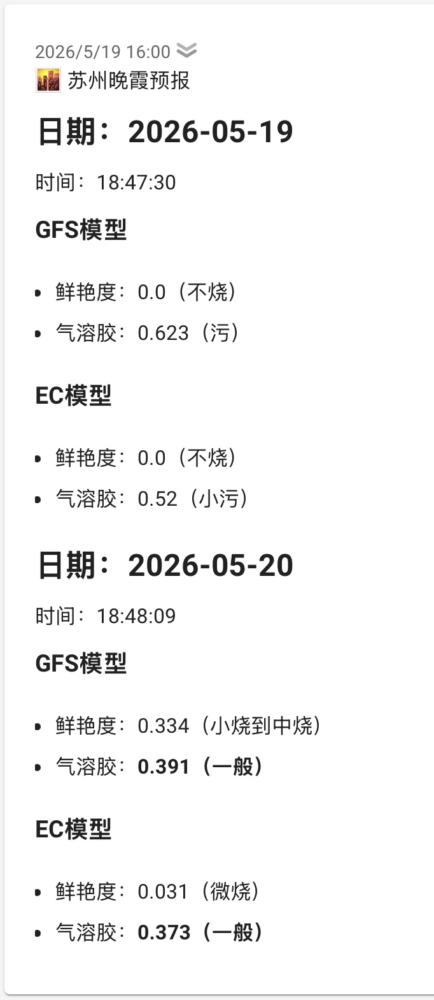

# 流霞

> 流霞，天边流动的彩霞。古人以"流霞"喻仙酒、喻美景，今以此名，捕捉朝暮之间那一抹转瞬即逝的绚烂。

流霞是一款朝霞晚霞预报与监控工具。它基于 GFS/EC 气象模型数据，每日定时获取朝霞/晚霞的鲜艳度与气溶胶预报，通过 [shoutrrr](https://github.com/containrrr/shoutrrr) 推送提醒，并提供 Web 数据看板用于历史数据的可视化分析。

由 sunsetbot.top 提供接口。Docker 镜像支持 `linux/amd64` 和 `linux/arm64` 架构。

## 功能特性

- **定时预报** — 基于 GFS/EC 模型，按配置时间自动获取朝霞/晚霞预报
- **智能推送** — 通过 shoutrrr 推送通知，按预报质量分 5 个等级，支持 Markdown 格式开关
- **数据看板** — 内置 Web 页面，支持折线图、模型对比、月度趋势、城市对比等可视化
- **最佳观赏排行** — 按历史数据排行 Top 10 高质量日期，季节对比分析
- **多城市监控** — 支持同时监控多个城市的朝霞/晚霞数据
- **数据持久化** — 自动写入 SQLite，支持 CSV/JSON 导出
- **Prometheus 指标** — 暴露 `/metrics` 端点，便于监控集成

## 部署

推荐使用 Docker Compose 部署：

```yaml
services:
  liuxia:
    container_name: liuxia
    image: ghcr.io/felix2yu/liuxia:latest
    ports:
      - "8080:8080"
    volumes:
      - ./data:/app/data
    environment:
      - CITY=江苏省-苏州,上海市-上海
      - BASE_URL=https://sunsetbot.top/
      - PUSH_ENABLE=true
      - PUSH_MARKDOWN=true
      - PUSH_URL=ntfy://ntfy.sh/Weather,tgram://bot-token/chatid
      - SEND_TEST_ON_START=false
      - PUSH_ERROR=true
      - MORNING_ENABLE=true
      - MORNING_TIME=18:00,00:00
      - MORNING_MODEL=GFS,EC
      - EVENING_ENABLE=true
      - EVENING_TIME=08:00,11:30,16:00
      - EVENING_MODEL=GFS,EC
      - DB_PATH=/app/data/liuxia.db
      - WEB_PORT=8080
      - DATA_RETENTION_DAYS=365
      - PUID=1000
      - PGID=1000
    restart: unless-stopped
```

## 环境变量

### 推送配置

| 变量 | 必填 | 默认值 | 说明 |
|------|------|--------|------|
| `PUSH_ENABLE` | 否 | `true` | 是否启用推送 |
| `PUSH_MARKDOWN` | 否 | `true` | 是否使用 Markdown 格式推送 |
| `PUSH_URL` | 否* | — | shoutrrr URL，支持多渠道逗号分隔（如 `ntfy://ntfy.sh/Weather,tgram://bot-token/chatid`） |
| `SEND_TEST_ON_START` | 否 | `false` | 启动时推送测试消息 |
| `PUSH_ERROR` | 否 | `true` | 请求错误时推送 |

> *启用推送时，需配置 `PUSH_URL`。

### 基础配置

| 变量 | 必填 | 默认值 | 说明 |
|------|------|--------|------|
| `CITY` | 是 | — | 城市，支持逗号分隔多城市，如 `江苏省-苏州` 或 `江苏省-苏州,上海市-上海` |
| `BASE_URL` | 否 | `https://sunsetbot.top/` | 服务基础 URL |
| `DB_PATH` | 否 | `liuxia.db` | SQLite 数据库文件路径 |
| `WEB_PORT` | 否 | `8080` | Web 看板端口 |
| `DATA_RETENTION_DAYS` | 否 | `365` | 数据保留天数，设为 `0` 禁用自动清理 |
| `PUID` | 否 | `1000` | 容器运行用户 UID |
| `PGID` | 否 | `1000` | 容器运行用户 GID |
| `TZ` | 否 | `Asia/Shanghai` | 时区 |

### 任务配置

| 变量 | 必填 | 默认值 | 说明 |
|------|------|--------|------|
| `MORNING_ENABLE` | 否 | `true` | 朝霞任务是否启用 |
| `MORNING_TIME` | 否 | `18:00,00:00` | 朝霞执行时间，逗号分隔 |
| `MORNING_MODEL` | 否 | `GFS,EC` | 朝霞模型，逗号分隔 |
| `EVENING_ENABLE` | 否 | `true` | 晚霞任务是否启用 |
| `EVENING_TIME` | 否 | `08:00,11:30,16:00` | 晚霞执行时间，逗号分隔 |
| `EVENING_MODEL` | 否 | `GFS,EC` | 晚霞模型，逗号分隔 |

## 消息推送

使用 [shoutrrr](https://github.com/containrrr/shoutrrr) Go 原生通知库，支持 30+ 通知渠道，无需额外部署，支持多渠道同时推送。

**配置环境变量：**

```yaml
PUSH_URL=ntfy://ntfy.sh/Weather
```

**多渠道同时推送：**

```yaml
PUSH_URL=ntfy://ntfy.sh/Weather,tgram://bot-token/chatid
```

**支持的 URL 格式：**

| 渠道 | URL 格式 |
|------|----------|
| ntfy | `ntfy://ntfy.sh/topic` |
| Telegram | `tgram://bot-token/chatid` |
| Slack | `slack://token-a/token-b/token-c` |
| Discord | `discord://token@channel` |
| 邮件 | `mail://smtp-server:port?username=xxx&password=xxx` |
| Pushover | `pover://token@userkey` |
| Gotify | `gotify://gotify-server/token` |

更多渠道请参考 [shoutrrr 文档](https://containrrr.dev/shoutrrr/)。

### 通知等级

通知等级对应关系：

- 过滤阈值：< 0.2 的数据会被过滤掉，不通知
- 0.2 - 0.4 → 等级 1
- 0.4 - 0.6 → 等级 2
- 0.6 - 0.8 → 等级 3
- 0.8 - 1.0 → 等级 4
- 1.0 及以上 → 等级 5

设置 `PUSH_MARKDOWN=true` 时，消息中质量、气溶胶数值较优秀时会加粗标记；设置为 `false` 则发送纯文本。



## 数据看板

启动后访问 `http://localhost:8080` 查看历史数据看板，支持：

- 多城市筛选
- 按朝霞/晚霞筛选
- 按日期范围查询
- 快捷时间范围（近1月/3月/半年/1年/全部）
- 鲜艳度和气溶胶折线图（按模型分组）
- 模型对比统计图表
- 月度趋势图表
- 城市对比图表
- 最佳观赏排行（Top 10 高质量日期）
- 季节对比分析
- 图表收起/展开（状态记忆）
- 图表导出为 PNG
- 深色/浅色主题切换（跟随系统）
- 表格分页（每页20条）
- 导出 CSV / JSON
- 移动端响应式设计

每次获取数据后自动写入 SQLite 数据库（`liuxia.db`），已存在数据自动更新。

## API 接口

| 端点 | 方法 | 说明 |
|------|------|------|
| `/api/data` | GET | 查询历史数据 |
| `/api/statistics` | GET | 获取统计数据 |
| `/api/rankings` | GET | 最佳观赏排行（Top 10 日期、月度、季节统计） |
| `/api/cities` | GET | 获取城市列表 |
| `/api/city-comparison` | GET | 城市间数据对比 |
| `/api/export` | GET | 导出数据（CSV/JSON） |
| `/api/health` | GET | 健康检查 |
| `/metrics` | GET | Prometheus 指标 |

### 查询参数

| 参数 | 说明 | 示例 |
|------|------|------|
| `city` | 城市筛选 | `江苏省-苏州` |
| `event_type` | 事件类型 | `morning` 或 `evening` |
| `start` | 开始日期 | `2024-01-01` |
| `end` | 结束日期 | `2024-12-31` |
| `format` | 导出格式 | `csv` 或 `json` |

### 响应头

| 头 | 说明 |
|------|------|
| `X-Cache` | 缓存命中状态：`HIT` 或 `MISS` |
